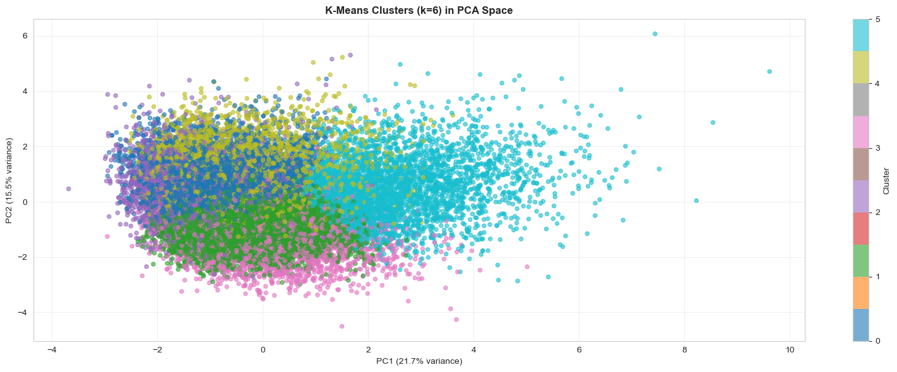
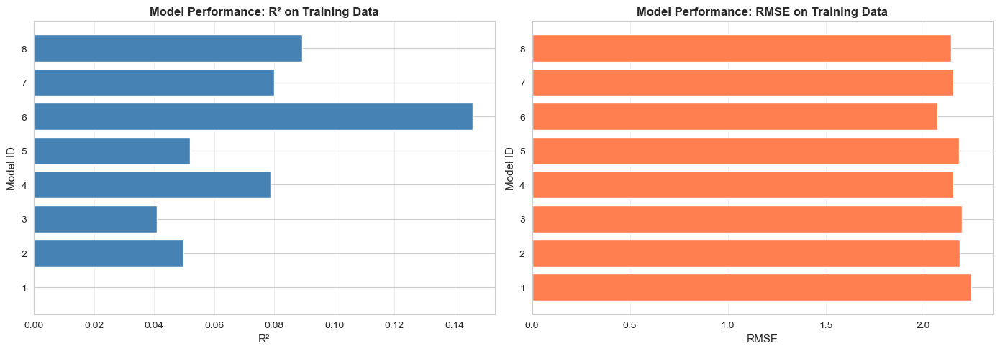
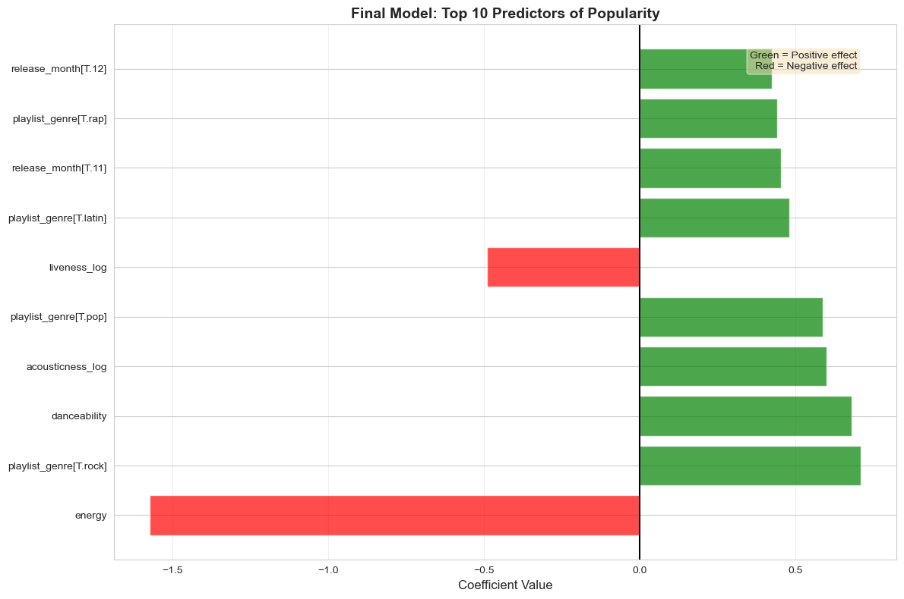

# 🎵 Spotify Song Popularity Predictor

**Can we predict song popularity from audio features alone?**

Spoiler: Not really. But the journey reveals fascinating insights about what *doesn't* make a hit song.

---

## 📊 Project Overview

This project analyzes **25,190 Spotify tracks** across 6 genres to determine whether audio features (danceability, energy, acousticness, etc.) can predict song popularity. Using clustering analysis and linear regression modeling, we explore the relationship between a song's acoustic profile and its commercial success.

### 🎯 Key Finding

> **Audio features explain only 7.4% of popularity variance.** The remaining 92.6% is driven by external factors like artist fame, marketing campaigns, and algorithmic promotion.

---

## 🔍 What We Discovered


### Audio Feature Insights
- ⬇️ **Higher energy = Lower popularity** (coefficient: -1.57, p < 0.001)
- ⬆️ **Higher danceability = Higher popularity** (coefficient: +0.68, p < 0.001)
- ⬆️ **Acoustic elements boost popularity** (coefficient: +0.60, p < 0.001)
- ⬇️ **Instrumental tracks underperform** (coefficient: -0.41, p < 0.001)

### Genre Effects
Rock, Pop, and Rap songs show higher baseline popularity than EDM and R&B, even after controlling for audio features.

### Clustering Findings



Songs cluster naturally into 6 groups by audio characteristics (Acoustic/Chill, Feel-Good Pop, Spoken Word/Rap, etc.), but these clusters show minimal popularity differences. **Acoustic similarity ≠ popularity similarity.**

---

## 📁 Project Structure

```
├── data
│   ├── clean_spotify_data.csv
│   ├── cluster_assignments.csv
│   ├── final_model_coefficients.csv
│   └── log_transformed_spotify_data.csv
├── figures
│   ├── heatmap.png
│   ├── modelR2.png
│   ├── pca.png
│   └── top_feat.png
├── notebooks
│   ├── 01_exploratory_analysis.ipynb
│   ├── 02_clustering_analysis.ipynb
│   └── 03_linear_models.ipynb
├── readme.md
├── requirements.txt
└── src
    └── data_loader.py
```

---

## 🚀 Quick Start

### Prerequisites
- Python 3.8+
- Jupyter Notebook

### Installation

```bash
# Clone the repository
git clone https://github.com/boyeshenry-byte/Spotify-popularity-predictor.git
cd spotify-popularity-predictor

# Install dependencies
pip install -r requirements.txt

# Launch Jupyter
jupyter notebook notebooks/01_data_exploration.ipynb
```

### Running the Analysis

Execute notebooks in order:
1. **01_data_exploration.ipynb** - Loads raw data, performs EDA, exports cleaned CSVs
2. **02_clustering_analysis.ipynb** - Clusters songs by audio features
3. **03_linear_models.ipynb** - Builds and validates regression models

---

## 📈 Methodology

### Data Source
[TidyTuesday Spotify Songs Dataset](https://github.com/rfordatascience/tidytuesday/tree/master/data/2020/2020-01-21) containing 32,833 songs with Spotify's audio feature API data.

### Data Preprocessing
- Removed 7,643 duplicate tracks (same song on multiple playlists)
- Applied logit transformation to popularity: `log(p/(1-p))`
- Log-transformed right-skewed features: speechiness, acousticness, instrumentalness, liveness
- Final dataset: 25,190 unique songs × 16 features

### Analysis Pipeline

**1. Exploratory Data Analysis**
- Correlation analysis (no feature correlates >0.10 with popularity)
- Distribution analysis (identified right-skew requiring transformation)
- Feature relationship visualization

**2. Unsupervised Learning**
- K-Means clustering (k=6 optimal via elbow method)
- PCA dimensionality reduction (30.5% variance in 2 components)
- Cluster characterization and popularity comparison

**3. Supervised Learning**
- Tested 8 regression models (baseline to complex interactions)
- 5-fold cross-validation for model selection
- Final model: Linear additive (46 coefficients, R²=0.074)

---

## 📊 Model Performance



| Model | Coefficients | R² (Train) | R² (CV) | Status |
|-------|--------------|------------|---------|--------|
| Baseline | 1 | 0.000 | 0.000 | ❌ No predictive power |
| Categorical Only | 36 | 0.050 | 0.046 | ⚠️ Weak |
| Continuous Only | 11 | 0.041 | 0.039 | ⚠️ Weak |
| **All Linear** | **46** | **0.079** | **0.074** | ✅ **Selected** |
| Continuous² | 56 | 0.052 | — | ⚠️ No improvement |
| All² | 895 | 0.146 | -1.3e21 | ❌ Catastrophic overfit |
| Derived Features | 52 | 0.080 | 0.075 | ⚠️ Marginal gain |
| Complex | 101 | 0.089 | 0.080 | ⚠️ Overlaps with Model 4 |

**Selected Model:** All Linear Additive (Model 4)
- **Why?** Simplest model with competitive performance. 95% confidence intervals overlap with more complex models.
- **Occam's Razor:** 46 coefficients vs 101 (Model 8) for ~0.6% R² gain isn't justified.

---

## 🎓 Key Takeaways



### What Audio Features Tell Us
1. **Energy is the strongest predictor** - but negatively correlated (lower energy = more popular)
2. **Danceability and acousticness** have positive but modest effects
3. **Genre matters**, but even within genres, audio features explain little variance

### What's Missing from the Dataset
The low R² (7.4%) indicates that **non-audio factors dominate popularity**:
- 🎤 **Artist Recognition** - Beyoncé vs unknown indie artist
- 💰 **Marketing Budget** - Radio play, playlist placement, PR campaigns
- 🤖 **Algorithmic Boost** - Spotify's recommendation engine
- 📅 **Cultural Timing** - Right song at the right cultural moment
- 🌊 **Viral Effects** - TikTok trends, social media amplification

### Implications
- **For Artists:** Production quality matters, but marketing/timing matter more
- **For ML Engineers:** Audio features work for *similarity*, not *popularity prediction*
- **For Researchers:** External data (artist metrics, social signals) is critical

---

## 🛠️ Technologies Used

**Core Libraries:**
- `pandas` - Data manipulation
- `numpy` - Numerical computing
- `matplotlib` / `seaborn` - Visualization
- `scikit-learn` - Machine learning (K-Means, PCA, cross-validation)
- `statsmodels` - Statistical modeling (OLS regression)
- `scipy` - Hierarchical clustering

**Analysis Techniques:**
- K-Fold Cross-Validation (5 folds)
- Principal Component Analysis
- Ordinary Least Squares Regression
- Feature Engineering (log transformations, polynomial terms)

---

## 📚 Dataset Details

**Features (16 total):**

| Category | Features |
|----------|----------|
| **Target** | `track_popularity` (0-100, log-transformed) |
| **Audio** | danceability, energy, loudness, speechiness, acousticness, instrumentalness, liveness, valence, tempo |
| **Metadata** | key (0-11), mode (major/minor), duration_ms |
| **Categorical** | playlist_genre, release_year, release_month, decade |

**Data Source:** [Spotify Web API](https://developer.spotify.com/documentation/web-api/reference/get-audio-features)

---

## 📖 Notebooks

### [01_data_exploration.ipynb](notebooks/01_data_exploration.ipynb)
**Exploratory Data Analysis**
- Data cleaning and duplicate removal
- Popularity distribution transformation (logit)
- Correlation analysis (max |r| = 0.10)
- Feature relationship visualization
- **Output:** Cleaned datasets exported to `/data`

### [02_clustering_analysis.ipynb](notebooks/02_clustering_analysis.ipynb)
**Unsupervised Learning**
- K-Means clustering (k=6 optimal via elbow method)
- Cluster interpretation (Acoustic/Chill, Feel-Good Pop, etc.)
- PCA visualization (30.5% variance in 2D)
- **Finding:** Clusters separate by features but NOT by popularity

### [03_linear_models.ipynb](notebooks/03_linear_models.ipynb)
**Predictive Modeling**
- 8 regression models tested (baseline to complex interactions)
- 5-fold cross-validation for model selection
- Final model: All linear additive (R² = 0.074)
- **Conclusion:** Audio features alone are insufficient predictors

---

## 🔮 Future Work

**Short-term Improvements:**
1. Elastic Net regularization on high-interaction models
2. Random Forest / Gradient Boosting to capture non-linearities
3. Classification approach (predict "hit" vs "non-hit" threshold)

**Long-term Enhancements:**
1. **External data integration:**
   - Artist Spotify follower counts
   - Social media engagement metrics
   - Playlist placement data (editorial vs algorithmic)
   - Radio airplay statistics
2. **Time-series analysis:** How popularity evolves post-release
3. **Deep learning:** Neural networks with artist embeddings

---

## 👤 Author

**Henry Boyes**
- GitHub: [@boyeshenry-byte](https://github.com/boyeshenry-byte)
- LinkedIn: [Henry Boyes](https://linkedin.com/in/hboyes)
- Email: boyeshenry@gmail.com

---

## 📄 License

This project is licensed under the MIT License - see the [LICENSE](LICENSE) file for details.

---

## 🙏 Acknowledgments

- **Data Source:** [TidyTuesday](https://github.com/rfordatascience/tidytuesday) community
- **Spotify:** For providing the Web API and audio feature documentation
- **Inspiration:** Understanding the gap between audio quality and commercial success

---

## 📞 Questions?

Feel free to open an issue or reach out if you have questions about the methodology or findings!

---

**⭐ If you found this analysis interesting, please consider starring the repository!**
